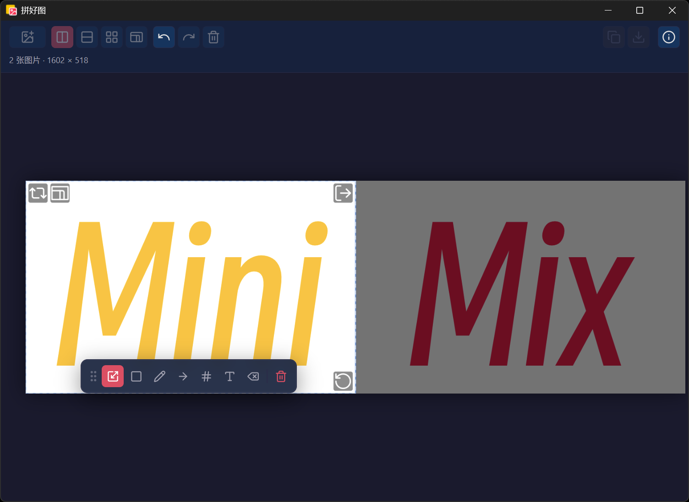

# 拼好图 MiniMix

<p align="center">
  
</p>

<p align="center">
  <strong>拖入图片，拼出完美矩形。</strong>
</p>

---

## 为什么选“拼好图”？

<p align="center">
  
</p>

**“拼好图”的每一张输出都是完美的矩形**——没有多余边距、没有不规则裁切，直接可用。

- **始终矩形输出** — 无论你拖入多少张图、怎么排列，最终结果一定是规整矩形
- **所见即所得** — 拖入即排版，实时预览，零学习成本
- **逐张精调** — 裁切、旋转、缩放、平移，每张图都能单独调整
- **预设比例** — 无论是单张图片还是整体画面，都可以锁定固定比例，始终按照需要的比例输出
- **标注功能** — 自带基本的绘画和文本功能，可以在排版同时完成简单标注
- **桌面原生** — 支持文件右键「打开方式」直接唤起，支持批量拖入或者直接粘贴

## 快速上手

1. 打开 MiniMix
2. 把图片拖进去（或者直接粘贴也行）
3. 图片自动排列成整齐的行/列
4. 调整满意后点击导出（或者直接复制） — 得到一张完美的矩形大图

## 功能一览

| 功能 | 说明 |
|------|------|
| 智能排版 | 自动按比例等高/等宽排列，支持多行多列分组 |
| 单图编辑 | 裁切、旋转（角拖）、缩放（滚轮）、平移 |
| 自由排序 | 拖拽调整图片位置和分组 |
| 自动比例 | 一键调整成预设比例，支持单图、多图以及合成图片的整体比例 |
| 标注功能 | 单图支持简单的几何图形、铅笔、箭头、序号和文字等绘图工具 |
| 多格式导出 | PNG / JPG，可调质量和分辨率（10%-300%） |
| 一键复制 | 导出结果直接复制到剪贴板 |
| 撤销 / 重做 | 完整操作历史，放心试 |


## 技术栈

Tauri v2 + 原生 Canvas 渲染。

## 开发

```bash
npm install
npm run tauri:dev    # 开发模式
npm run tauri:build  # 构建安装包
```

## License

MIT
